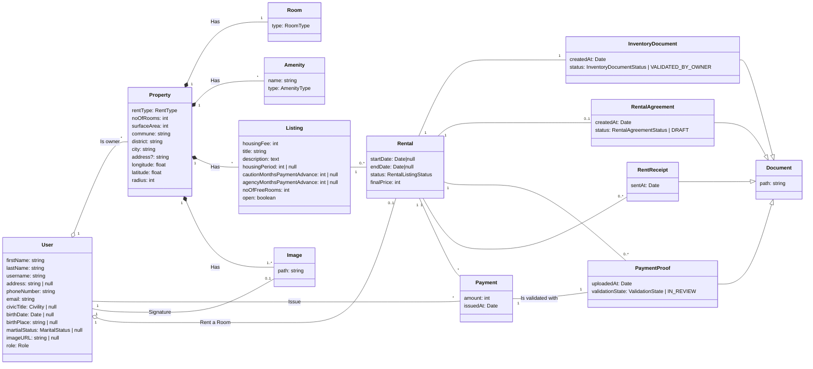

```mermaid
classDiagram

direction LR

%% Classes
class Property {
    rentType: RentType
    noOfRooms: int
    surfaceArea: int
    commune: string
    district: string 
    city: string
    address?: string
    longitude: float 
    latitude: float
		radius: int
}


class User {
    firstName: string
    lastName: string
    username: string
    address: string | null
    phoneNumber: string
    email: string
    civicTitle: Civility | null
    birthDate: Date | null
    birthPlace: string | null
    martialStatus: MaritalStatus | null
    imageURL: string | null
    role: Role
}

class Amenity {
    name: string
    type: AmenityType
}


class Room {
    type: RoomType
}

class Listing {
    housingFee: int
    title: string
    description: text 
    housingPeriod: int | null
    cautionMonthsPaymentAdvance: int | null
    agencyMonthsPaymentAdvance: int | null
    noOfFreeRooms: int
    open: boolean
}


class Rental {
    startDate: Date|null
    endDate: Date|null
    status: RentalListingStatus
    finalPrice: int
}

%% Contrat de location
class RentalAgreement {
    createdAt: Date
    status: RentalAgreementStatus | DRAFT
}

%% Etat des lieux
class InventoryDocument {
    createdAt: Date
    status: InventoryDocumentStatus | VALIDATED_BY_OWNER
}

class Document {
    path: string
}

class Image {
    path: string
}

class Payment {
    amount: int
    issuedAt: Date
}

class RentReceipt {
    sentAt: Date
}

class PaymentProof {
    uploadedAt: Date
    validationState: ValidationState | IN_REVIEW
}


%% Relations
User "1" o-- "*" Property : Is owner
Property "1" *-- "1" Room : Has
Property "1" *-- "*" Amenity : Has 
Property "1" *-- "*" Listing : Has

Property "1" *-- "1..*" Image : Has

Rental "1" -- "1" InventoryDocument
Rental "1" -- "0..1" RentalAgreement
Rental "1" -- "0..*" PaymentProof
Rental "1" -- "0..*" RentReceipt

Listing "1" -- "0..*" Rental


User "1" -- "*" Payment : Issue
User "1" -- "0..1" Image : Signature
Rental "1" -- "*" Payment


PaymentProof --|> Document 
RentalAgreement --|> Document 
InventoryDocument --|> Document 
RentReceipt --|> Document 

User "1" o-- "0..1" Rental : Rent a Room

Payment "1" -- "1" PaymentProof : Is validated with 

```